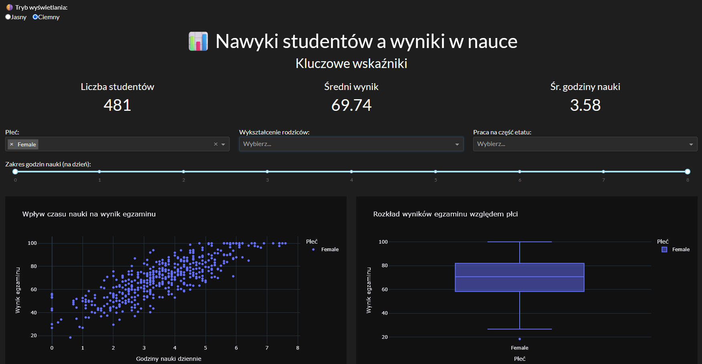

# 📊 Student Habits vs Academic Performance – Interaktywny Dashboard

## Opis projektu

Celem projektu jest stworzenie kompletnej wizualizacji danych w formie interaktywnego dashboardu z wykorzystaniem biblioteki Dash. Analizowany zbiór danych dotyczy nawyków studentów i ich wpływu na wyniki w nauce.

Dashboard zawiera przemyślaną prezentację danych, różnorodne typy wykresów oraz możliwość interakcji z użytkownikiem.

## 📁 Użyty zbiór danych

Student Habits vs Academic Performance – symulowany, realistyczny zbiór danych zawierający 1000 rekordów studentów, opisanych na podstawie m.in.:
* codziennego czasu nauki i snu,
* korzystania z social mediów i Netflixa,
* jakości diety i zdrowia psychicznego,
* obecności na zajęciach i uczestnictwa w aktywnościach dodatkowych,
* poziomu wykształcenia rodziców,
* jakości internetu,
* wyniku egzaminu (exam_score).

Zbiór nadaje się do zadań z zakresu EDA, regresji, klasyfikacji, a także do zastosowań edukacyjnych.

## 🧰 Technologie

* Python 3.x
* Dash
* Pandas
* Plotly Express

## 📈 Funkcjonalności dashboardu

* Wiele typów wykresów (scatter plot, bar chart, pie chart, histogram, boxplot, heatmap)
* Filtry interaktywne (np. wybór płci, poziomu edukacji rodziców, zakresu godzin nauki)
* Zmienna koloryzacja i formatowanie (legendy, tytuły, opisy osi)
* Responsywny układ dashboardu
* Opis i interpretacja każdego wykresu

## 🌐 Link do aplikacji online

[Kliknij tutaj, aby zobaczyć dashboard na żywo](https://wd-projekt-zaliczeniowy.onrender.com/)

## 📝 Podsumowanie wymagań projektu

✔️ Liczba wykresów: 6 (scatter plot, bar chart, pie chart, histogram, boxplot, heatmap)  
✔️ Różne typy wykresów wykorzystane zgodnie z przeznaczeniem  
✔️ Możliwość interakcji: filtry dropdown, range sliders  
✔️ Dobór typów wykresów adekwatny do danych  
✔️ Formatowanie wykresów: tytuły, opisy osi, legendy, kolory  
✔️ Spójność i sensowność całości  
✔️ Estetyka i wytłumaczenia wykresów

## 📷 Przykładowe screeny

## ▶️ Uruchomienie aplikacji lokalnie

1. Sklonuj repozytorium:

`git clone https://github.com/DawidKa00/WD-Projekt-Zaliczeniowy` \
`cd WD-Projekt-Zaliczeniowy`

2. Zainstaluj zależności:

    `pip install -r requirements.txt`

3. Jeśli nie masz jeszcze danych w folderze data/, dodaj swój plik kaggle.json (z zakładki "My Account" na kaggle.com):
   
* Umieść `kaggle.json` w folderze głównym projektu (np. WD-Projekt-Zaliczeniowy/)
* Plik zostanie automatycznie użyty do pobrania danych podczas pierwszego uruchomienia

4. Uruchom aplikację:

    `python main.py`

Dashboard będzie dostępny pod adresem http://127.0.0.1:8050/.

## 👤 Autorzy

Dawid Kapciak, Konrad Janiszewski  
Informatyka,  
Uniwersytet Śląski
